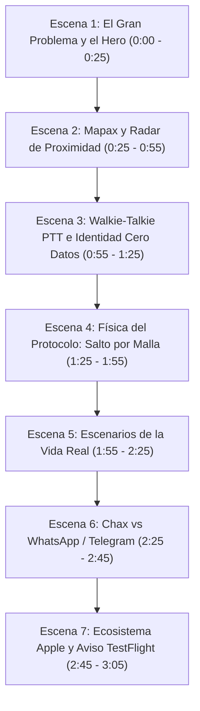

# STORYBOARD Y GUIÓN DE PRODUCCIÓN (16:9 HORIZONTAL)
## Video Explicativo Completo: "Chax: Rápido online, imparable mesh"
**Duración estimada:** ~2:45 a 3:00 minutos  
**Formato:** 1920x1080 (16:9 Horizontal)  
**Tono:** Enérgico, tecnológico, visualmente deslumbrante y fácil de entender.

---

### RESUMEN DE ESCENAS

---

## DETALLE TÉCNICO Y NARRATIVO POR ESCENA

### ESCENA 1: EL PROBLEMA UNIVERSAL Y LA PROMESA DE CHAX
- **Tiempo:** 0:00 - 0:25
- **Visual en Pantalla:**
  - Toma amplia de la página web oficial `chax.chat` en 16:9.
  - Efecto dinámico: el fondo de partículas de malla interactiva en canvas (`#meshBackground`) se mueve lentamente.
  - La cámara hace un zoom suave hacia el título principal: *"Rápido online. Imparable mesh."*
  - Se iluminan las pastillas de valor: `⚡ Red Nostr Ultrarrápida`, `🎙️ Walkie-Talkie PTT`, `🗺️ Mapax Satelital Offline`, `🛡️ Cero Números`.
- **Audio / Locución (Narrador o Host 1):**
  > *"¿Cuántas veces has estado en un festival masivo, en una carretera sin cobertura o en medio de un apagón y tu app de mensajería simplemente se muere? WhatsApp, Telegram o Signal dependen al 100% de torres celulares e internet. Pero hoy existe una alternativa radical: se llama **Chax**. Una app ultrarrápida para tu día a día, pero con un as bajo la manga que nadie más tiene: una malla Bluetooth que sigue funcionando cuando el mundo se queda sin señal."*
- **Texto en Pantalla (Lower-Third):**
  - `CHAX: Mensajería P2P de Nueva Generación`
  - `Rápido en Internet • Imparable por Bluetooth Mesh`

---

### ESCENA 2: MAPAX Y RADAR MESH DE PROXIMIDAD
- **Tiempo:** 0:25 - 0:55
- **Visual en Pantalla:**
  - Desplazamiento fluido hacia la sección Bento (`#superpoderes`).
  - Zoom a la tarjeta de **Mapax: Cartografía Satelital & Radar Mesh**.
  - Se activa la animación en vivo del radar: la aguja gira, el círculo verde pulsa y muestra: *"Nodo detectado: Javier • 42m Rumbo 312° NO"*.
  - Transición a pantalla partida con la captura real de la app en iPhone (`docs/assets/screenshots/03_mapax.png` y `04_radar_mesh.png`) mostrando el mapa topográfico y satelital en alta resolución.
- **Audio / Locución (Narrador o Host 2):**
  > *"La primera función que te vuela la cabeza se llama **Mapax**. Imagina tener mapas satelitales y de terreno de altísima resolución guardados directamente en la memoria de tu teléfono sin consumir un solo mega de tu plan. Y junto a los mapas, un radar táctico que calcula el azimut magnético y la distancia exacta en metros hacia tus amigos. Si te separas en la montaña o entre la multitud, el radar te guía paso a paso hacia ellos, sin necesidad de satélites caros ni antenas externas."*
- **Texto en Pantalla (Overlay):**
  - `MAPAX: Mapas Satelitales 100% Offline`
  - `Radar de Proximidad en Metros y Rumbo Azimutal`

---

### ESCENA 3: WALKIE-TALKIE PTT E IDENTIDAD SOBERANA
- **Tiempo:** 0:55 - 1:25
- **Visual en Pantalla:**
  - Foco en la tarjeta Bento del **Walkie-Talkie Push-To-Talk (PTT)**.
  - Las barras de ecualizador de audio se animan simulando una transmisión de voz instantánea.
  - Zoom a la tarjeta púrpura: **Cero Teléfonos. Cero Cuentas. Cero Espionaje**.
  - Animación del código QR y la huella criptográfica (`FP: A416...BDE5 • Cifrado X25519 E2EE`).
  - Mostrar la captura real de chat (`docs/assets/screenshots/02_chat_directo.png`).
- **Audio / Locución (Host 1 & Host 2):**
  > *"Pero no todo es texto. Chax incluye un Walkie-Talkie Push-to-Talk de grado táctico: mantienes presionado, hablas y tu voz viaja al instante por radio local, acompañada de transcripción inteligente en tu chip. Y lo mejor de todo: **en Chax no existe tu número de teléfono**. Tu identidad no le pertenece a ninguna compañía telefónica; se genera dentro del enclave seguro de tu propio iPhone o Mac con llaves criptográficas puras. Nadie puede suspender tu cuenta ni vender tus datos."*
- **Texto en Pantalla (Overlay):**
  - `Audio Push-To-Talk de transmisión instantánea`
  - `Identidad Criptográfica en Enclave Seguro (Sin Número)`

---

### ESCENA 4: LA FÍSICA DEL PROTOCOLO (¿CÓMO VIAJA SIN SEÑAL?)
- **Tiempo:** 1:25 - 1:55
- **Visual en Pantalla:**
  - Desplazamiento a la sección interactiva de diagramas (`#diagramas`).
  - Visualización del flujo animado:
    - Diapositiva 1: Tu teléfono emite a 100m. Salta de 1 a 2 teléfonos, de 2 a 4 hasta llegar al amigo destino.
    - Se iluminan las etiquetas de TTL (Time-To-Live) y cifrado de paquete cerrado.
    - Diapositiva 2: Si un teléfono en la cadena toca señal, actúa como puente automático hacia los relés de Nostr globales.
- **Audio / Locución (Host 1):**
  > *"¿Cómo viaja un mensaje si no hay internet ni antenas? Es pura física de protocolo: tu dispositivo cifra el paquete con la llave pública de tu contacto y lo emite en un radio de 100 metros por Bluetooth Low Energy. Si tu destinatario está más lejos, los teléfonos intermedios con Chax reciben el paquete sellado y lo rebotan en abanico: de 1 a 2, de 2 a 4 teléfonos, recorriendo kilómetros hasta encontrar a su dueño. Y ojo: los teléfonos intermedios solo hacen de relevo; no pueden abrir ni leer una sola coma de tu mensaje."*
- **Texto en Pantalla (Overlay):**
  - `Malla Mesh Multi-Salto (Store-and-Forward)`
  - `Cifrado de Extremo a Extremo en Cada Salto`

---

### ESCENA 5: CASOS DE USO CRÍTICOS EN LA VIDA REAL
- **Tiempo:** 1:55 - 2:25
- **Visual en Pantalla:**
  - Recorrido rápido por las 4 tarjetas de escenarios (`#problemas`):
    1. **Conciertos y Festivales:** Ilustración de multitud, 60,000 personas, redes 5G saturadas.
    2. **Montaña y Senderismo:** Excursionistas con radar y mapas sin cobertura celular.
    3. **Privacidad Cotidiana:** Cero metadatos corporativos.
    4. **Desastres y Huracanes:** Enjambre de rescate comunitario cuando se cae la red eléctrica.
- **Audio / Locución (Host 2):**
  > *"Esto no es teoría de laboratorio; resuelve situaciones de todos los días. En un festival con 60,000 personas donde las antenas colapsan, Chax vuela porque cada persona es un repetidor. En excursiones de montaña, mantienes a todo tu grupo ubicado. Y durante huracanes, terremotos o apagones masivos donde las redes telefónicas se caen por días, Chax crea una red vecinal imparable que rescata vidas."*
- **Texto en Pantalla (Overlay):**
  - `Festivales Masivos • Montaña y Aventura`
  - `Huracanes y Terremotos • Privacidad Total`

---

### ESCENA 6: CHAX FRENTE A LOS GIGANTES DE LA INDUSTRIA
- **Tiempo:** 2:25 - 2:45
- **Visual en Pantalla:**
  - Foco en la tabla comparativa (`#diario`):
  - Zoom en las columnas: WhatsApp (Cruz roja ✕), Telegram (Cruz roja ✕), Signal (Cruz roja ✕) frente a Chax (Check verde ✓ en todas las filas).
  - Efecto de destaque en: *¿Funciona sin internet? Solo Chax*, *¿Exige número? Cero en Chax*.
- **Audio / Locución (Host 1):**
  > *"Cuando comparas a Chax con WhatsApp, Telegram o Signal, la diferencia es abismal. Todas las demás mueren en cuanto se apaga el módem o te alejas de una antena. Ninguna otra tiene mapas satelitales ni Walkie-Talkie offline integrados. Chax es tu mensajero veloz de todos los días por internet, pero blindado para cuando todo lo demás falla."*
- **Texto en Pantalla (Overlay):**
  - `WhatsApp, Telegram y Signal mueren sin conexión`
  - `Chax: Autonomía Soberana Absoluta`

---

### ESCENA 7: ECOSISTEMA NATIVO APPLE Y EL AVISO URGENTE
- **Tiempo:** 2:45 - 3:05
- **Visual en Pantalla:**
  - Showcase interactivo de dispositivos (`#capturas`):
  - Mockup en 16:9 con las capturas de iPhone, iPad y Mac (`docs/assets/screenshots/mac/`, `ipad/`, `iphone/`).
  - Animación del Banner Dorado de Urgencia (`#urgencia`):
    - *"Mejor tenerla instalada antes: sin señal ya no hay cómo descargarla."*
  - Botón verde brillante con enlace a TestFlight: `https://testflight.apple.com/join/hmfhvFdf`.
  - Logo oficial de Chax y cierre con música de impacto.
- **Audio / Locución (Host 1 & Host 2 al unísono):**
  > *"Chax está construido en código Swift nativo para exprimir la potencia y batería de tu iPhone, iPad y Mac. Pero hay una regla de oro que debes recordar:*
  > ***Descárgala hoy. Porque cuando estés en medio de la emergencia o sin señal en el concierto, no vas a poder abrir la tienda de apps para instalarla.***
  > *Entra ahora mismo a chax.chat o pulsa el enlace de TestFlight e instálala gratis. Chax: Rápido online, imparable mesh."*
- **Texto en Pantalla (Call to Action Final):**
  - `📱 Descarga Chax Gratis en TestFlight`
  - `🌐 chax.chat`
  - `iPhone • iPad • Mac (Apple Silicon & Intel)`

---

## CONSEJOS DE POSTPRODUCCIÓN Y MONTAJE
1. **Pista de Audio:** Se puede generar con el Dossier en NotebookLM (exportando el audio MP3), o grabando la voz en off con el guion superior.
2. **Música de Fondo:** Pista instrumental electrónica sutil / cyberpunk elegante / synthwave de baja intensidad a -18dB.
3. **Subtítulos Dinámicos:** Letras blancas con reborde sutil en la parte inferior central para visualización sin sonido en redes sociales.
